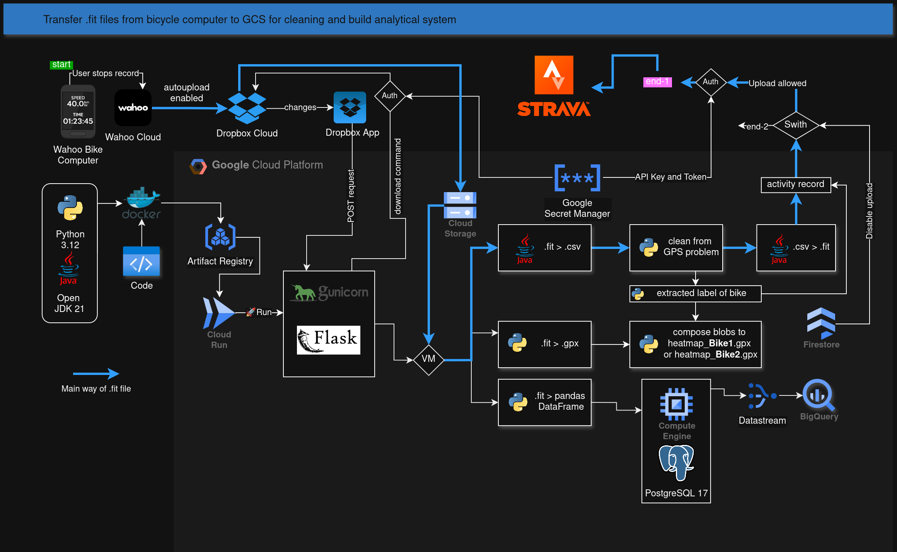

# BigBikeData

A monorepo for processing cycling activity data from .FIT files (Garmin/cycling computers). It consists of two independent Flask services, both deployed on Google Cloud Run.

```
BigBikeData/
├── power_core/        # Backend — internal activity processing pipeline
├── site_handler/      # Frontend — public web interface for users
└── gcp_actions/       # Shared GCP utilities library (external dependency)
```

## Architecture Overview



## Services

| Service | Directory | Description | Access |
|---------|-----------|-------------|--------|
| **[power_core (readme)](https://github.com/pathexplorer/BigBikeData/blob/master/power_core/README.md)** | `power_core/` | Internal backend — processes .FIT files from Dropbox and from user uploads via Pub/Sub. Cleans GPS data, uploads to Strava, builds heatmaps, stores in PostgreSQL. | Internal (private Cloud Run) |
| **[site_handler (readme)](https://github.com/pathexplorer/BigBikeData/tree/master/site_handler)** | `site_handler/` | Public-facing web app. Users upload .FIT files, get cleaned files back via email download links. Sits behind Firebase Hosting with domain allowlist. | Public (Firebase Hosting → Cloud Run) |

## Key Features

- **FIT File Processing** — decode, analyze, and re-encode .FIT cycling activity files
- **GPS Data Cleaning** — detect and fix bad GPS coordinates in recorded activities
- **Dropbox Sync** — webhook-triggered sync of .FIT files from a Dropbox watched folder
- **Strava Integration** — automatic upload of cleaned activities with correct bike gear
- **Heatmap Building** — composite GPX heatmaps using GCS object composition
- **PostgreSQL / PostGIS** — store track points for spatial queries and analysis
- **Email Notifications** — send download links via SMTP or Brevo API
- **Internationalization** — English and Ukrainian UI support (Flask-Babel)
- **GCP Pub/Sub** — asynchronous pipeline orchestration (public user uploads → backend processing)

## Deployment

Both services are deployed via Google Cloud Build:

```bash
# Backend
gcloud builds submit --config power_core/cloudbuild.yaml

# Frontend
gcloud builds submit --config site_handler/cloudbuild.yaml
```

The frontend is fronted by Firebase Hosting, which provides security redirects and rewrites traffic to the `site_handler` Cloud Run service.

## Dependencies

Both services share an external dependency on the [`gcp_actions`](https://github.com/pathexplorer/gcp_actions) package for GCP utilities (Pub/Sub, Firestore, GCS, Secret Manager, etc.).
