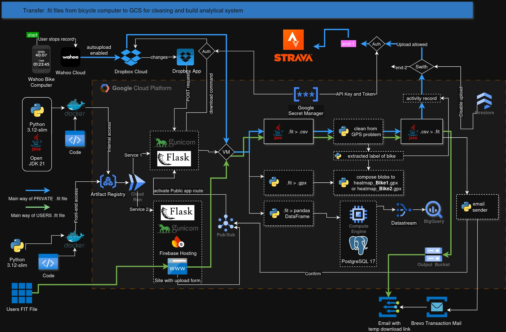

# BigBikeData

A monorepo for processing cycling activity data from .FIT files (Garmin/cycling computers). It consists of two independent Flask services, both deployed on Google Cloud Run.

```
BigBikeData/
├── power_core/        # Backend — internal activity processing pipeline
├── site_handler/      # Frontend — public web interface for users
└── gcp_actions/       # Shared GCP utilities library (external dependency)
```

## Architecture Overview



## Services

| Service | Directory | Description | Access |
|---------|-----------|-------------|--------|
| **[power_core (readme)](https://github.com/pathexplorer/BigBikeData/blob/master/power_core/README.md)** | `power_core/` | Internal backend — processes .FIT files from Dropbox and from user uploads via Pub/Sub. Cleans GPS data, uploads to Strava, builds heatmaps, stores in PostgreSQL. | Internal (private Cloud Run) |
| **[site_handler (readme)](https://github.com/pathexplorer/BigBikeData/tree/master/site_handler)** | `site_handler/` | Public-facing web app. Users upload .FIT files, get cleaned files back via email download links. Sits behind Firebase Hosting with domain allowlist. | Public (Firebase Hosting → Cloud Run) |

## Key Features

- **FIT File Processing** — decode, analyze, and re-encode .FIT cycling activity files
- **GPS Data Cleaning** — detect and fix bad GPS coordinates in recorded activities
- **Dropbox Sync** — webhook-triggered sync of .FIT files from a Dropbox watched folder
- **Strava Integration** — automatic upload of cleaned activities with correct bike gear
- **Heatmap Building** — composite GPX heatmaps using GCS object composition
- **PostgreSQL / PostGIS** — store track points for spatial queries and analysis
- **Email Notifications** — send download links via SMTP or Brevo API
- **Internationalization** — English and Ukrainian UI support (Flask-Babel)
- **GCP Pub/Sub** — asynchronous pipeline orchestration (public user uploads → backend processing)

## Deployment

### 0. Gather external service credentials (before any provisioning)

Dropbox (app per env + Wahoo connection), Strava, email (Brevo/SMTP), and the
site-hosting domain are **manually-obtained, per-environment values**. Gather
them first — the cloud setup depends on them. See
[`external_services_setup.md`](documentation/external_services_setup.md) for the
step-by-step instructions and the pre-flight checklist.

### 1. Infrastructure Provisioning (one-time per environment)

The recommended way is the **one-shot guided setup**, which walks you through
the external-services wizard, then bootstraps the cloud project, and finally
writes the runtime config + secrets:

```bash
cd documentation/startup

# Full guided setup (external-services wizard → cloud bootstrap → runtime config)
./main.sh dev     # or prod

# Unattended / CI preview (no wizard, no GCP changes)
./main.sh dev --dry-run --no-wizard

# Post-deploy Pub/Sub wiring (after the first Cloud Run deploy)
./main.sh wire dev

# Preview runtime config only (no GCP changes)
./main.sh runtime dev --dry-run

# Remove all provisioned resources for an environment
./main.sh cleanup dev --dry-run    # preview first!
```

`main.sh` is the **single entry point** — it orchestrates the internal scripts
in `documentation/startup/scripts/`. `setup` is the default command, so plain
`./main.sh dev` runs the full guided setup.

This creates: GCP project, IAM, Secret Manager, Pub/Sub topics, Artifact Registry, Firestore, GCS buckets, and Service Accounts.

### 2. Service Deployment (per code change)

Both services are deployed via Google Cloud Build:

```bash
# Backend (from repo root)
gcloud builds submit --config power_core/cloudbuild.yaml

# Frontend (from repo root)
gcloud builds submit --config site_handler/cloudbuild.yaml
```

The frontend is fronted by Firebase Hosting, which provides security redirects and rewrites traffic to the `site_handler` Cloud Run service.

## Dependencies

Both services share an external dependency on the [`gcp_actions`](https://github.com/pathexplorer/gcp_actions) package for GCP utilities (Pub/Sub, Firestore, GCS, Secret Manager, etc.).

## Code Documentation

All Python modules, classes, and functions carry docstrings. Follow the `technical-writer` conventions when writing or reviewing them:

- Keep docstrings to 1–3 lines; explain **why** or domain context, not what the code already shows.
- Module docstrings are exactly 1–2 sentences describing the module's core purpose.
- Rely on type hints — avoid `Args:`/`Returns:` sections unless the signature is dynamic or untyped.
- Always use triple double-quotes; single-line docstrings end on the same line.

Every tracked `.py` file should have a module docstring, and every class and function its own.
